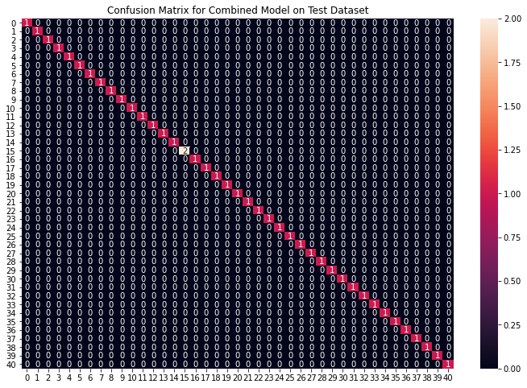

# Disease-Prediction-Using-ML

## Overview

This project aims to implement a robust machine-learning model to efficiently predict diseases based on symptoms exhibited by a patient. Using a comprehensive dataset from Kaggle, the model leverages multiple classification algorithms to ensure high accuracy and reliability in predictions.

## Problem Definition

In the realm of medical diagnostics, quick and accurate disease identification based on symptoms can significantly enhance treatment outcomes. This project addresses the need for an automated system that can predict diseases from a given set of symptoms with high accuracy, thereby aiding healthcare professionals in their diagnostic processes.

## Dataset Description

The dataset utilized for this project is sourced from Kaggle, comprising two CSV files for training and testing. The training dataset includes 133 columns, 132 of which are symptom indicators and one is the prognosis. The dataset is balanced with an equal number of samples for each disease class.

## Methods and Technologies Used

### Data Preparation

- **Cleaning**: Conversion of categorical data to numerical format using Label Encoding.
- **Balancing**: Verification of class balance to prevent model bias.

### Model Building

- **Algorithms Employed**:
  - Support Vector Classifier (SVC)
  - Gaussian Naive Bayes Classifier
  - Random Forest Classifier

- **Validation Method**:
  - K-fold cross-validation (k=10) to ensure model robustness.

### Prediction Strategy

A combination prediction strategy was implemented by taking the mode of predictions from the three models. This ensemble method enhances the prediction's robustness and accuracy.

## Results

This project achieved remarkable results, with all models reaching 100% accuracy during the testing phase. Below are detailed insights and visualizations that demonstrate the model's capabilities:

### Model Accuracy and Performance

- **Accuracy**: Each of the models (Support Vector Classifier, Gaussian Naive Bayes, and Random Forest Classifier) achieved a perfect accuracy score of 100% in the test evaluations. This demonstrates their high reliability in diagnosing diseases based on symptoms.
  
- **Confusion Matrix Visualization**: The confusion matrices for each model show no misclassifications, highlighting their robustness in handling the diverse set of symptoms in the dataset.

### Visualizations

Visual evidence of model performance provides a clear and concise way to present the effectiveness of the models used. Below are the plots showing the balanced accuracy and the confusion matrices for each model.

#### Accuracy Plot

This plot shows the consistent accuracy achieved by all models throughout the testing phase.

#### Confusion Matrix for SVM Classifier

")

These visuals underscore the precision with which the models have been able to predict each class of diseases, reinforcing the efficacy of the ensemble prediction strategy that combines outputs from multiple models to enhance diagnostic accuracy.

## Discussion

The results from this project not only validate the chosen methodologies and technologies but also demonstrate the potential of machine learning in medical diagnostics. The ensemble approach, in particular, proves highly effective in leveraging the strengths of individual models to achieve greater predictive accuracy.

## Conclusion

The success of this project showcases the potential for machine learning to revolutionize disease diagnosis processes, providing support to healthcare professionals and improving patient outcomes through timely and accurate disease detection.
